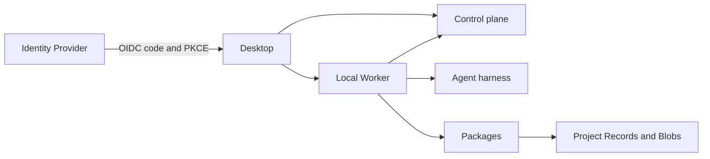

Kalligator separates shared data, local execution, and domain capabilities. This boundary keeps machine access on the Worker while the control plane remains the authority for Team data.

## Program ownership

| Program | Responsibilities |
| --- | --- |
| Control plane | Accounts, Teams, Projects, Package configuration, Project Records, Blobs, and owner-private Chat history |
| Worker | Harness processes, local resume state, Project directories, Packages, local services, durable write queue, and Resource Locks |
| Desktop | Presentation state, the OIDC session, Chats, Settings, and optional Package sections |
| Package | Domain guidance, declared commands, optional local service, settings, secrets, and Package-owned Project Records |

## Projects and Chats

A **Project** groups related Chats, files, and Package state. A **Chat** is one resumable Agent thread within a Project.

Each Chat keeps one harness and one Package capability snapshot for its lifetime. Changes to Package access apply to new Chats. They do not silently change the command boundary of an existing Chat.

Chat Events store the visible conversation and tool provenance. Child Agents remain inside the parent Chat. Their read-only Agent Threads preserve the delegation relationship.

## Identity and data scope

The control plane owns Accounts, Teams, Team Memberships, and Roles. Projects and Package data are Team-scoped. Chats are private to their owner.

Local authentication is valid only when the control plane uses a loopback address. OIDC uses the system browser, Authorization Code with PKCE, and an audience-scoped access token.

One Worker state directory binds to one Account. This prevents harness logins, Package Secrets, workspaces, and queued writes from crossing Account boundaries.

## Local-first behavior

The Worker queues supported Project Record writes before it confirms them. Reads merge queued and central records while the control plane is unavailable.

<Note>
  Kalligator does not claim full offline operation. You need the control plane to sign in, read or change Projects, and start or resume a Chat.
</Note>

## Stable technical identifiers

The user-visible name is Kalligator. Existing technical identifiers can still use `mobile-lab`, `mobilelab`, or `kaligator` for compatibility.

Do not rename environment variables, protocol names, storage paths, OIDC identifiers, image names, or Package host interfaces unless the change includes a migration plan.
