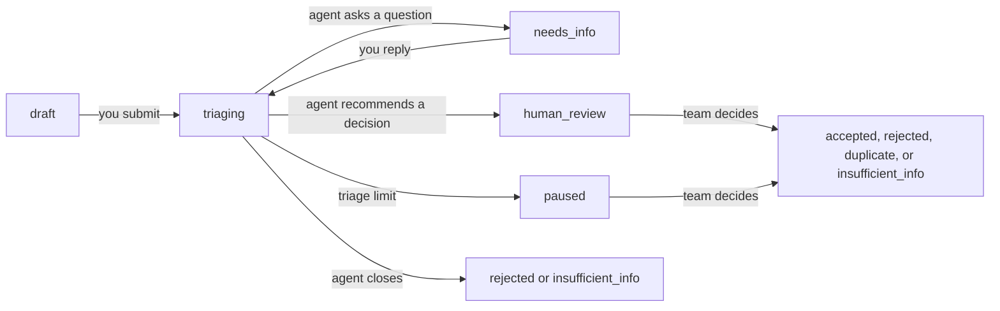

A report goes from draft, to triage, to a final decision. This page gives the rules for each status. The `status` value is the value in the API. The website shows the display text.

## Statuses

| `status` | Display text | Holds a slot | Final |
| --- | --- | --- | --- |
| `draft` | Draft | No | No |
| `triaging` | In triage | Yes | No |
| `needs_info` | Needs your reply | Yes | No |
| `paused` | Paused | Yes | No |
| `human_review` | In review | No | No |
| `accepted` | Accepted | No | Yes |
| `rejected` | Rejected | No | Yes |
| `duplicate` | Duplicate | No | Yes |
| `insufficient_info` | Closed: insufficient information | No | Yes |
| `withdrawn` | Withdrawn | No | Yes |

You can have at most five reports that hold a slot.

## Transitions

- **You** submit a draft, reply to a question, or withdraw a report.
- **The triage agent** asks a question, closes a report as rejected or insufficient information, or sends the report to review.
- **The system** pauses a report when triage reaches a limit. A technical failure sends the report to review. A limit or a failure is never evidence that your report is not valid.
- **The Kalligator team** makes the final decision on a report in review or paused. The team can also open a report again for more triage.

You can withdraw a report from `triaging`, `needs_info`, `paused`, or `human_review`.

## What you can do in each status

| Action | Statuses | Email must be verified |
| --- | --- | --- |
| Read the report, files, and messages | All | No |
| Edit the draft | `draft` | Yes |
| Upload or remove files | `draft`, and statuses before a final decision | Yes |
| Submit | `draft` | Yes |
| Send a message | `triaging`, `needs_info`, `paused`, `human_review` | Yes |
| Withdraw | `triaging`, `needs_info`, `paused`, `human_review` | No |

Only a message in `needs_info` starts a new triage turn.

## Decision

After a final decision, the report has a `decision` with:

- `outcome`: `accepted`, `rejected`, `duplicate`, or `insufficient_info`
- `at`: the time of the decision
- `message`: an optional message to you

A rejection message tells you why. A duplicate message gives the reason and a date. It does not give the title, the text, or the author of the other report.

The triage assessment, the assigned severity, and the reward reason stay internal.

## Programs that change

If a program becomes hidden, or removes you from its invited hackers, you can still read your reports. You cannot save, submit, or change the files of a draft for that program.
